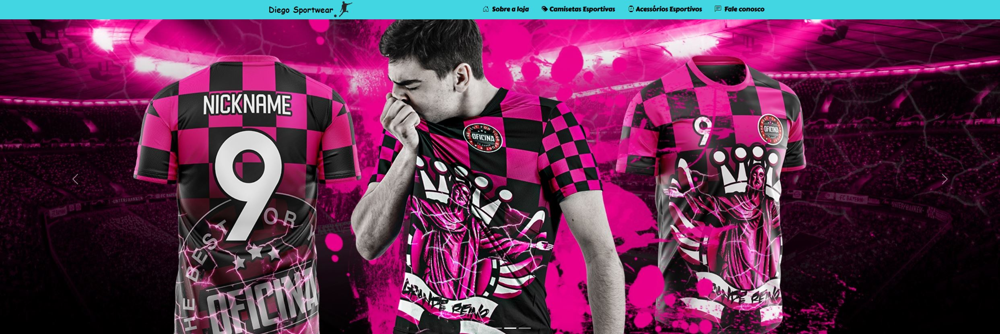

# Lading Page Diego Sportwear

<h2>Descrição do Projeto</h2>
Lading page feita para a conclusão do módulo 14 do curso: Desenvolvedor FullStack Java.
Lading page de uma loja online de acessorios esportivos. Site responsivo para tablets e smartphones (first mobile), usando tecnologias como Jquery, máscaras e bootstrap.

<h2>
    Pré-visualização
 </h2>
  <h3>Landing Page de Loja</h3>

 

## Skills utilizadas:

 
  
  
  
  
  
  
  

 

<h2>Visualização Online</h2>
  
A landing page do projeto está disponível para visualização na Vercel. Você pode acessá-la através do seguinte link:
 https://diego-sportwear-vuzl.vercel.app/
